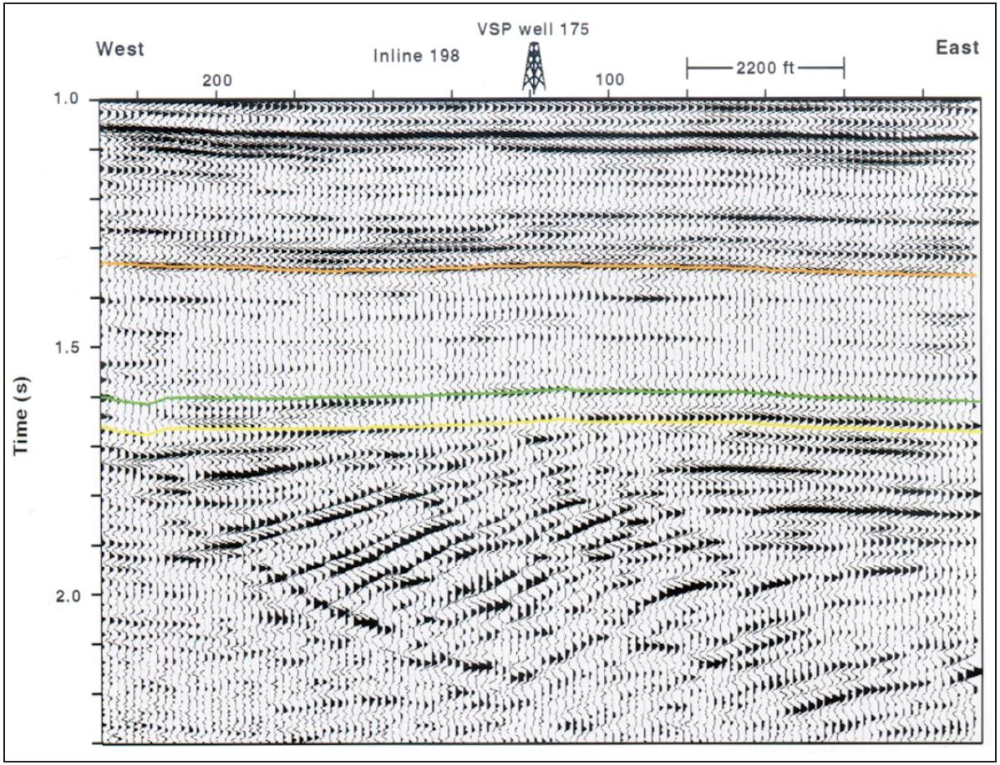
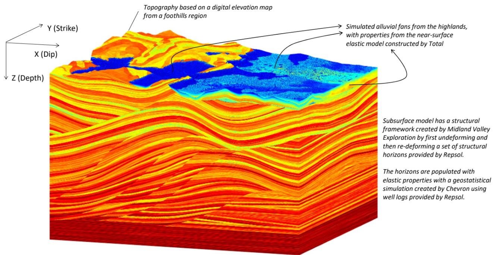
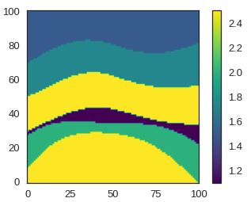

# **Datasets**

Documentation for the datasets used in **COmpressive Seismic Acquisition Design (COSAD)** project:

* `cube4.npy`
* `data.npy`
* `spii15s.npy`
* `syn3D_cross-spread2.npy`

# **`cube4.npy`**
Real data from the Stratton 3D Survey, a small land 3D data set from South Texas located in Stratton Field, a fluvially deposited gas. The complete 3D source/receiver geometry consists of east-west receivers lines spaced 402 m apart (12 arrays in total) and north-south source lines spaced 268 m apart. To download the complete dataset, refers to https://wiki.seg.org/wiki/Stratton_3D_survey.

**Seismic adquisition parameters:**

* Time samples (`nt`) = `1001`
* Number of traces (`nx`) = `80`
* Number of shots (`ns`) = `18`
* Time interval (`dt`) = `0.003` ms
* Trace interval (`dx`) = `25` m

The reservoir interval involved was the Oligocene Frio Formation - a thick, fluvially deposited sand-shale sequence that has been a prolific gas producer in Stratton Field. Due to stratigraphic complexity, this dataset represent a challenge for shot reconstruction. For a detailed study of the Stratton Field, refers to: https://www.searchanddiscovery.com/pdfz/documents/geophysical/hardage/images/hardage01.pdf.html

# **`data.npy`**
Synthetic dataset composed of 40 shots with 970 ms in-depth and 3.15 km of horizontal length. For seismic traces reconstruction, it was selected shot #20 and cropped to 800 and 100 samples in time and traces, respectively. For further information refers to https://github.com/PyLops/curvelops/blob/main/examples/Demo_Seismic_Regularization.ipynb.

**Seismic adquisition parameters:**

* Time samples (`nt`) = `800`
* Number of traces (`nx`) = `100`
* Number of shots (`ns`) = `1`
* Time interval (`dt`) = `0.568` ms
* Trace interval (`dx`) = `5` m

# **`spii15s.npy`**
This data was built by the SEG Advanced Modeling Program (SEAM) during its second project, called "SEAM Phase II–Land Seismic Challenges". The Foothills models are focused on mountainous regions with sharp topography at the surface and compressive fold and thrust tectonics at depth, which makes this dataset a challenge for shot reconstruction. For further information refers to https://drive.google.com/file/d/12274Q1JupEP5g7jdEb_m_KQCgMunPuNA/view.

**Seismic adquisition parameters:**

* Time samples (`nt`) = `1034`
* Number of traces (`nx`) = `100`
* Number of shots (`ns`) = `15`
* Time interval (`dt`) = `0.004` ms
* Trace interval (`dx`) = `12.5` m

In the Foothills 3D survey, shot lines run in the strike direction (along the Y-axis); the receiver lines run in the dip direction (along the X-axis). The first shot is located at position (X,Y)=(500,500). The inline shot spacing (spacing in Y) is 25 m. The crossline spacing (spacing in X between shot lines) is 250 m. There are 55 lines and 461 shots per line, for a total of 25,355 shots. The sources cover a rectangular 13.5 x 11.5 km patch, which is more or less centered in the model, leaving a border approximately 500 m wide around the edges. To acess the data, please contact the SEG SEAM Phase II project manager, Michael Oristaglio `oristaglioml@gmail.com`.

# **`syn3D_cross-spread2.npy`**
Synthetic cross-spread seismic data modeled using finite differences with `devito` package (for further information refers to https://github.com/devitocodes/devito). The simulated geological conditions were continuous and parallel layers with increasing velocity in depth. The main geological structure is an anticline with hydrocarbon accumulation on its core, which causes velocity anomalies and high-amplitude reflection events. The total length of the seismic design is 1010 m horizontally and 1000 ms in depth.

**Seismic adquisition parameters:**

* Time samples (`nt`) = `1106`
* Number of traces (`nx`) = `101`
* Number of shots (`ns`) = `15`
* Time interval (`dt`) = `0.000905` ms
* Trace interval (`dx`) = `10` m

